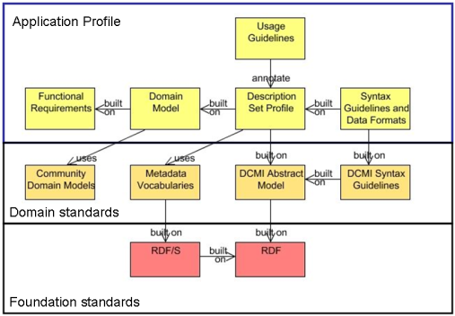

# Dublin Core Application Profile (DCAP)
### Revisiting the Singapore Framework....

The [Singapore Framework](http://dublincore.org/documents/singapore-framework/) was a pioneering attempt to formalise the creation of metadata application profiles and can be considered to have been 'ahead of its time'. With a growing mainstream interest in developing and managing metadata profiles in a wide variety of contexts, the time has come to revisit this framework and to address, in particular, one component - the *Description Set Profile*.

The goal of this project is to make the DSP *actionable*.

The project will build on a considerable body of prior art - much of which is documented on the DCMI website. In some cases, copies of resources from that website have been added to this repository for convenience.

The requirements for the Actionable DSP are being gathered and [documented here](requirements.md).

### Basics of Dublin Core Application Profiles

The general model of application profiles was described in the Singapore framework. This modeled the building blocks of a profile with an aim to maximize reusability. 

One implementation step was the creation of a Description Set Profile that contained the detailed, and potentially machine-actionable, description of the "things" the profile would describe and the terms used to describe them.

### Proposal for a New Description Set Profile

1. Classes and properties that are specific to the Description Set Profile are in a draft ttl file [here](dsp.ttl)
1. The elements that would be needed to create a profile are defined in a table [here](schemaList.csv). Because RDF does not support validation of metadata schemas, it is hoped that the actionable DSP can be implemented in the [Shapes Expression](http://shex.io/) (ShEx) language.
